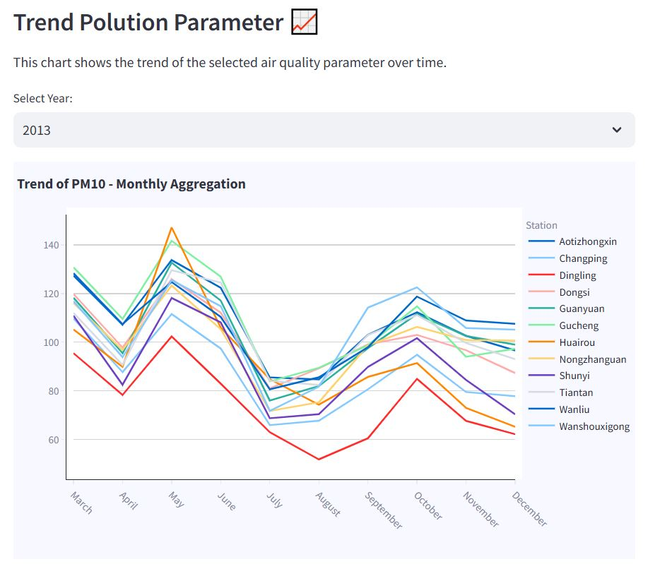
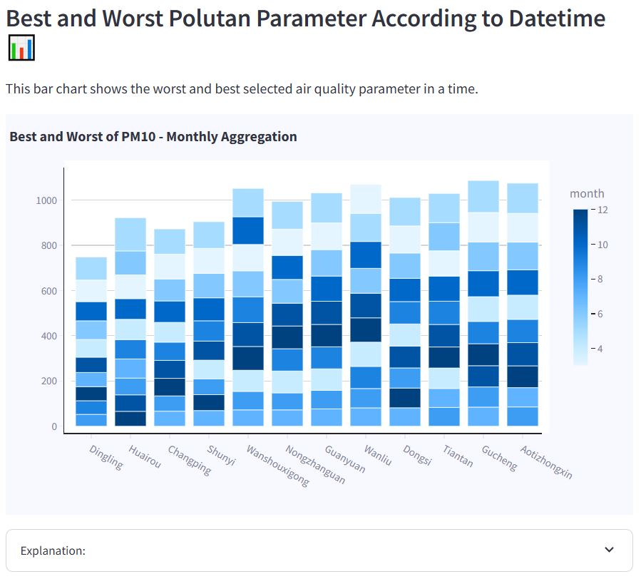
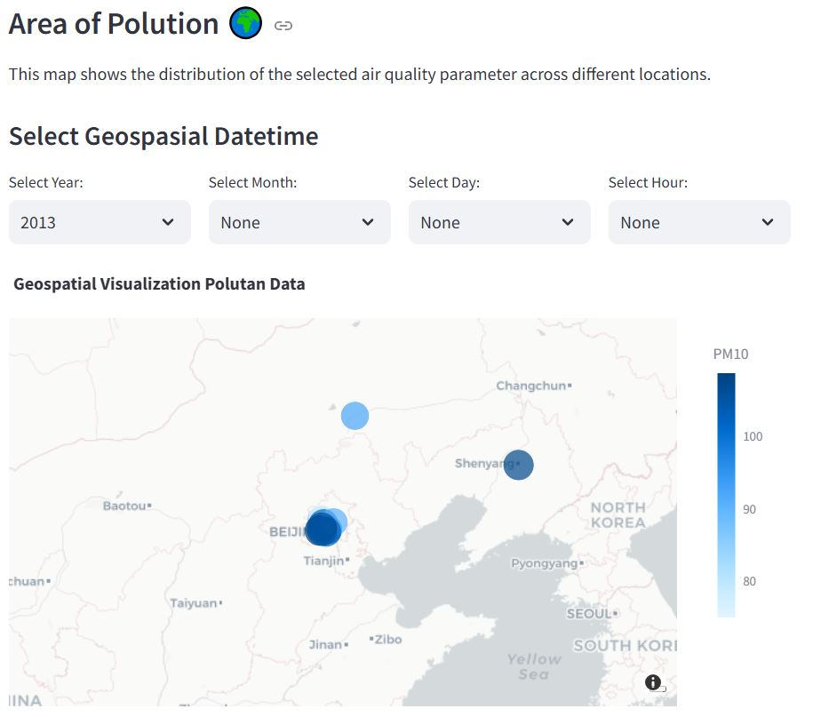
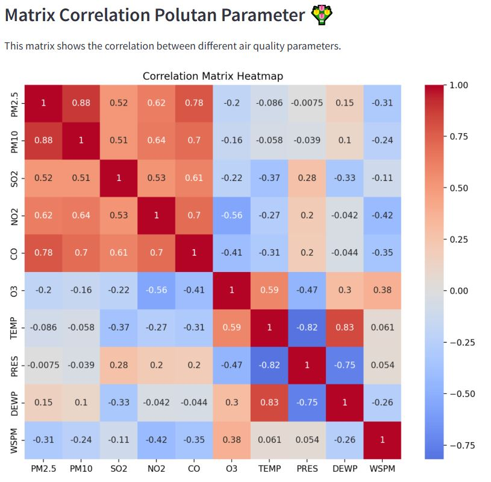

# Hello 👋🏻, Welcome to My Streamlit App

## **What is this Project?**
This project analyzes air quality data (AQI Index) in Beijing, China.  
You can access the dataset here: [Air Quality Dataset](https://github.com/marceloreis/HTI/tree/master).

## **How to Run It?**
You can run this project using two methods. Before starting, make sure to download or clone this repository to access all required files.
```
$git clone https://github.com/NgakanWidyasprana/data-analyst-aqi.git
```

### **Method 1: Run Locally**
1. **Install Streamlit**

    Install the Streamlit library using pip: 
    ```
    $ pip install streamlit
    ```
2. **Navigate to Project Folder**

    Change the directory to the project folder where `dashboard.py` is located:

    ```
    cd dashboard
    ```
3. **Run the Application**

    Use the following command to run the Streamlit applications:

    ```
    streamlit run dashboard/dashboard.py
    ```

### **Method 2: Run with Ngrok**
1. **Install Required Dependencies**

    Make sure the dependencies required for Ngrok are installed in your environment. You can check the dependencies in `requirement.txt`

2. **Open the Notebook**

    Open the `notebook.ipynb` file in your Jupyter Notebook or compatible environment.

3. **Follow the Instructions in the Notebook**

    Execute the cells step by step as mentioned in the notebook to run the application via Ngrok. This will generate a public URL to share your app with others.

## **Here some screenshot of my project**


> This chart shows the trend of AQI parameter overtime. In app you can adjust according to year, month, day, and hours.



> This chart shows the distribution of AQI parameter overtime. In app you can adjust according to year, month, day, and hours. Also the visualization already sort in descending order.



> This chart give geographic context overtime. In app you can adjust according to year, month, day, and hours.



> This chart shows the correlation matrix according to parameter AQI. You can analyst it to choose right parameter.